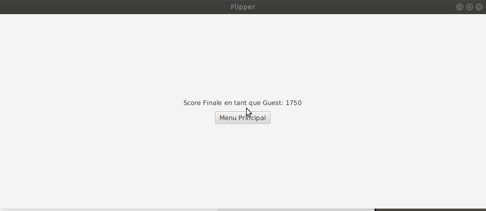

# Flipper

Ce projet consiste de deux mini projet. Un moteur physique codé en java et le flipper codé aussi en java a l'aide de javaFx

## Getting Started

Telechargez le dossier entier

```
cd flipper/
```

```
make run
```

## Prerequisites

Vous aurez besoin de java et de gradle.


## Authors

Les membres de ce projet sont Tanel OUBADIA, Yayha HAFID et Adam SAIMI

## How to Play

Lorsque vous lancez le jeu avec avec make run, une fenetre s'ouvre avec le menu principal. 
Dedans se trouve les highest score que vous avez fais.


Le jeu se lance et vous commencez avec la balle sur le launcher. Utilisez la barre espace pour lancez la balle. Les fleches gauche et droite permettent de dirigez les flips.


Lorsque la balle tombe lu est fini et une page s'ouvre nous montrant notre score permmetant de revenir au menu principal




## Acknowledgments

Nous mettons ici les sites qui nous ont été utiles dans la conception du jeu

* https://ericleong.me/research/circle-line/#moving-circle-and-static-line-segment
* https://seblee.me/2010/01/predicting-circle-line-collisions/
* https://stackoverflow.com/ (presque toute les réponse à nos question été sur ce site)
